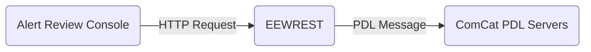

# EEWREST Architecture

## High Level Description

EEWREST is a web service that provides an HTTP API for sending ShakeAlert
follow-up messages over USGS's Product Distribution Layer (PDL).

The follow-up content sent by EEWREST was designed to be received/processed by ComCat for display
of on USGS earthquake event pages (found at earthquake.usgs.gov at the time of this writing).

EEWREST was created to encapsulate the logic for interfacing with the PDL client (a java command
line tool called ProductClient.jar).

The primary upstream user of EEWREST's API is the Alert Review Console (ARC).

### ShakeAlert Follow-up Message Passing Diagram

## Code Map

EEWREST is implemented using Flask web framework and follows the design paterns
found in Flask's documentation.  This allows easier use of third party packages
written for flask apps (eg. pytest-flask).

The program is started by the "flask" command which searches for a "create_app"
function in the module's __init__.py.

Here's a quick description of important files/directories:

`__init__.py`  
This module provides the Flask app factory function (`create_app()`)
that will be found by the Flask at startup (when the `flask` command is executed).  

`views.py`  
This module contains EEWREST's Flask view functions which implement it's HTTP
API structure and business logic.  View functions can be identified by looking
for the URL route mapping annotation provided by the Flask framework
eg. `@api.route('/')`.  All views in the module should be assigned to the Flask
Blueprint (a Blueprint is a container object for grouping view functions)
called "api".  This Blueprint is imported and registered to a new EEWREST Flask
app instance created at program startup when `create_app()`
(found in `__init__.py`) is called.

## Testing

EEWREST uses pytest as it's unit test framework (covered by Flask docs on testing).
See project README for pytest run instructions.

Here's a quick description of the test related dirs/files:

`test/`  
This directory defines the package test module.  All test related data and
pytest code should be put in this directory.

`test/input/`  
Files containing input used to feed test cases should be placed here. This is
usually done when input is too large to be coded into a test case function or
test fixture.

`test/conftest.py`  
Pytest fixture functions and generators.  The name "conftest" is a pytest
convention and allows for automatic discovery.

`test/test_routes.py`  
Pytest cases that exercise entire Flask views by sending HTTP requests to a
running flask app instance using the HTTP test client provided by the
pytest-flask plugin.
These integration level tests can are as close to end-to-end testing
as it gets, since running a PDL server instance to receive the final
message is not possible at the time of this writting.  Most tests in this
module verify the proper behavior by checking the subprocess command that
would be executed by the view function being tested.  Subprocess capture is
implemented using an mock subprocess object that is provided by a third
party package called fake-subprocess.

`test/test_util_functions.py`  
Pytest cases that cover helper/utility functions.  These are usually functions
used by a Flask view to perform some intermediate task.  Example: Parse a
small ID string that was extracted from message string.

## EEWREST's API (HTTP) Structure

Below is a brief description of the HTTP API that is exposed to the ARC for
the purpose of sending ShakeAlert follow-up messages via PDL.

* `GET /` \
  * Description: Alias for `GET /status`.
* `GET /status` \
  * Description: Returns a JSON status string and HTTP Response Code 200 if EEWREST is online and reachable.
* `POST /api/JSON2PDL/<event_code>` \
  * Description: Sends a ShakeAlert follow-up for the Confirmed or Qualified Alert case.  Accepts a JSON payload.
  * event\_code: The EEW event code for the event.  EEW event codes correspond to a PDL product of type Origin
    that was issued by ShakeAlert2PDL and have network code "ew".
* `POST /api/CANCEL2PDL/<event_code>` \
  * Description: Sends a follow-up message for the False Alert case.  Accepts an HTTP payload.
  * event\_code: The EEW event code for the event.  EEW event codes correspond to a PDL product of type Origin
    that was issued by ShakeAlert2PDL and have network code "ew".
* `POST /api/MISSING2PDL/<event_code>` \
  * Description: Sends a missed alert follow-up message.
  * event\_code: The event code of the event that was missed.  Event should have an network
    source code from an RSN.  The EEW network source code "ew" should not be used.
* `GET /api/ASSOCIATE/?eventID=<event_code_1>&otherID=<event_code_2>`
  * Sends an associate message for re-associating events existing in ComCat's database.

## Project Development Practices

* Flask view functions should have a corresponding pytest case.
* Make sure views are assigned to the Blueprint "api" found in views.py.
* Try to keep business logic outside external to views (preferrably in a
separate function).  Any side effects of calling a view (eg. file I/O) should
be defined in a separate function so they can be mocked during unit testing.
* Use PEP8 code formatting where possible (flake8 for code format checking).
* Type hints should be added where they increase readability.

## Security

No authentication is built into EEWRESTs API interface at the time.  Access
to it's HTTP interface should be limited to localhost using the systems firewall.

EEWREST should be run as a non-root user.  This can be set in it's systemd unit file
when running in a production environment.

## Quirks

Notes on workarounds and edge cases that arise while interfacing with PDL.

### Unusual Event Codes

PDL Event Codes usually consist of the 2 character network code of the source
Regional Seismic Network (nc, ci, us, etc.) and an alphanumeric product code
eg. 123345678, 1a24u8c937, etc.  Source networks on PDL's development server
are known to use network codes not used on production. The best known being
Caltech's development network code "cidev". This is handled by adding special
cases like "cidev" to an expected network code list so the parser can search
for them. PDL doesn't enforce any limitation on network codes, however PDL
production seems to adhere to 2 character codes, so EEWREST uses this as it's
default if a network code is not found in it's expected list.

### ProductClient Invocation To Send False Alert Follow-up

The False Alert follow-up use case (called cancellation in the code) is handled differently
than other follow-up use cases since it requires 2 subprocess calls to ProductClient.jar instead
of one.  The calls must be made in the following order:  

1. The first call attaches a QuakeML file that contains the event parameters along with required
option flag `--mainclass=gov.usgs.earthquake.eids.EIDSInputWedge`.  The RSA private key must be
provided in this call using option `--privateKey=<key_file_here>` if sending to the PDL production
server.
2. The second call accepts an html text snippet via stdin pipe. This is used to communicate text
that will end up in a ComCat web page banner. It uses the options `--content` to trigger enable
stdin content along with the content type flag to specify the html payload
`--content-type=text/html`.  The The RSA key is not required for this call, so it's option flag is
left out of the subprocess command.  Omission of the private key works as long as the subprocess is
not closed between calls.
